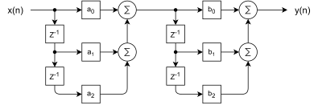

# 2.3 - Removing Interference from a Speech Signal

- The project was completed using Matlab. The file can be found [here](Lab_2_3.m).
- The html page showing the code along with the outputs of the plots is located [here](html/Lab_2_3.html).
- The audio files are linked below.
    - [Original Audio File](AudioSignals/BadAudio.flac)
    - [Filtered Audio File](AudioSignals/FilteredAudio.flac)

## Prompt for Lab 2.3

**Part 2.3 Design an FIR nulling filter to remove two interfering sinusoids, and also assess how much the desired signal is distorted by the nulling process.**

- **Part a)** Load the file speechbad which contains one signal, xxbad, which is the sum of a speech signal plus very large amplitude sinusoids at 1555 Hz and 2222 Hz. The sinusoids start and stop during the utterance. The sampling rate of this signal is 8000 Hz, and the good speech signal was scaled so that its maximum value is one. Listen to this signal to verify that the interference is so strong that the speech is not recognizable. Make a spectrogram (in dB).
- **Part b)** Design a cascade of two FIR nulling filters to remove the sinusoids completely. This can be accomplished by finding the numerical values of the filter coefficients for each second-order nulling filter. Combine the cascaded filters into one equivalent FIR filter, and give the filter coefficients of the equivalent filter.
- **Part c)** Plot the frequency response of the cascaded nulling filter designed in the previous part. Indicate the frequencies where the nulls are found.
- **Part d)** Process the corrupted signal, xxbad, through the nulling filters. Make two spectrograms (in dB): one for the input signal and the other for the output signal. Point out features that verify that the nulling filters operated correctly.

## Task

An unintelligible audio signal was provided to process. The signal contained speech along with two overpowering interference frequencies. These interference peaks are at 𝑓_𝑎=2222 𝐻𝑧 and at 𝑓_𝑏=1555 𝐻𝑧 . The main requirement for this section is to remove the interfering frequencies with a resulting clear speech signal.

## Filter Design

To “cancel out” these interfering frequencies, an FIR nulling filter can be used. A simple second-order filter is defined as follows:
𝐻(𝑛)=𝑔_0+𝑔_1 𝑧^(−1)+𝑔_2 𝑧^(−2)
𝑔_0=1,𝑔_2=−2 cos⁡(𝜔 ̂_𝑛𝑢𝑙𝑙), 𝑔_2=1
Since there are two nulling frequencies, these two filters can be placed in a cascading style.

The simplification of the two cascading filters is shown to the right. For two second-order filters, the resultant filter is a fourth-order filter. This will reduce the number of multiplications for each point from six to five.

The solution for the resultant fourth order filter coefficients can be calculated by multiplying the two filters 𝐻_𝑎 and 𝐻_𝑏. The solution is also found by calculating the convolution of the two filter’s coefficients.

𝐻_𝑐=𝐻_𝑎 𝐻_𝑏→{𝑎_0, 𝑎_1, 𝑎_2 }∗{𝑏_0, 𝑏_1, 𝑏_2 }
𝐻_𝑐=(𝑐_0, 𝑐_1, 𝑐_2, 𝑐_3, 𝑐_4)∙(𝑧^0, 𝑧^(−1),𝑧^(−2),𝑧^(−3),𝑧^(−4))

The frequency response of the filter is shown below.

The original signal and noisy signal’s frequency spectrums are shown below. The peaks at the interfering frequencies are reduced and the original signal fidelity is maintained after the filter was applied.

## Conclusion

**Original Audio Signal:** “Thieves who rob friends deserve jail.”

This is a “Harvard Sentence”, which is 1 of 720 sentences commonly used for standardized testing of telecommunication systems.

- ["Harvard Sentence" - Columbia](https://www.cs.columbia.edu/~hgs/audio/harvard.html)
- [Wikipedia Article](<https://en.wikipedia.org/wiki/Harvard_sentences>)