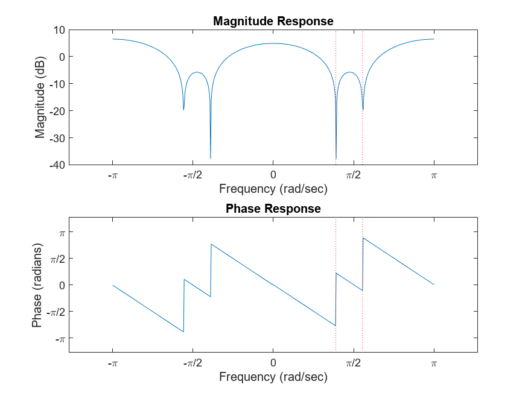
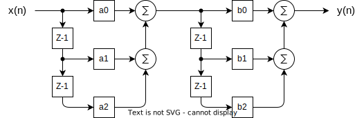

# 2.3 - Removing Interference from a Speech Signal

- The project was completed using the [Lab_2_3.m](Lab_2_3.m) file.
- The document showing the code along with the outputs of the plots is located [here](html/Lab_2_3.html).

## Prompt from the Document

**Part 2.3 Design an FIR nulling filter to remove two interfering sinusoids, and also assess how much the desired signal is distorted by the nulling process.**

- **Part a)** Load the file speechbad which contains one signal, xxbad, which is the sum of a speech signal plus very large amplitude sinusoids at 1555 Hz and 2222 Hz. The sinusoids start and stop during the utterance. The sampling rate of this signal is 8000 Hz, and the good speech signal was scaled so that its maximum value is one. Listen to this signal to verify that the interference is so strong that the speech is not recognizable. Make a spectrogram (in dB).
- **Part b)** Design a cascade of two FIR nulling filters to remove the sinusoids completely. This can be accomplished by finding the numerical values of the filter coefficients for each second-order nulling filter. Combine the cascaded filters into one equivalent FIR filter, and give the filter coefficients of the equivalent filter.
- **Part c)** Plot the frequency response of the cascaded nulling filter designed in the previous part. Indicate the frequencies where the nulls are found.
- **Part d)** Process the corrupted signal, xxbad, through the nulling filters. Make two spectrograms (in dB): one for the input signal and the other for the output signal. Point out features that verify that the nulling filters operated correctly.

## Output Graphs

## Filter Design

### Original Cascade Second-Order Nulling Filters

### Combining the Filters
Here the two second-order filters are combined into a fourth-order filter.

### Resulting Fourth-Order Nulling Filter
Here the two second-order filters are combined into a fourth-order filter.

