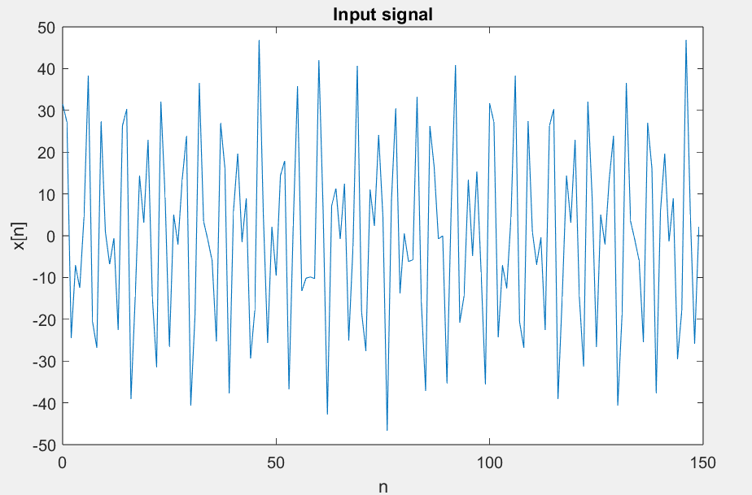
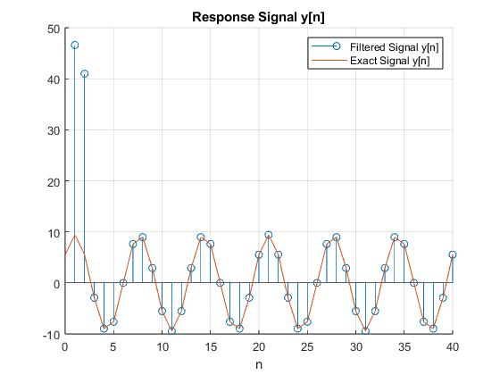

# 3.1 Nulling Filters for Rejection

## Introduction
The goal of this lab is to study the response of FIR filters to inputs such as complex exponentials and sinusoids. As a result, we should learn how to characterize a filter by knowing how it reacts to different frequency components in the input. This lab also introduces two practical filters: bandpass filters and nulling filters. Bandpass filters can be used to detect and extract information from sinusoidal signals, e.g., tones in a touch-tone telephone dialer. Nulling filters can be used to remove sinusoidal interference, e.g., jamming signals in a radar. 

## Nulling Filters
Nulling filters are filters that completely eliminate some frequency component. If the frequency is $\omega = 0$ or $\omega = \pi$, then a two-point FIR filter will do the nulling. The simplest possible general nulling filter can have as few as three coefficients. If $\omega_{n}$ is the desired nulling frequency, then the following length-3 FIR filter will be in the form:

y[n] = x[n] - 2cos($\omega_{n}$)x[n-1] + x[n-2]

### Part (a) 
Design a filtering system that consists of the *cascade of two FIR nulling filters* that will eliminate the following input frequencies: $\omega = 0.44\pi$, and $\omega = 0.7\pi$. For this part, derive the filter coefficients of both nulling filters:

Coefficients of $h_{1}$ for $\omega_{n} = 0.44\pi$:

$b_{0} = 1$

$b_{1} = -2cos(0.44\pi) = -0.3748$

$b_{2} = 1$

Coefficients of $h_{2}$ for $\omega_{n} = 0.7\pi$:

$b_{0} = 1$

$b_{1} = -2cos(0.7\pi) = 1.1755$

$b_{2} = 1$

### Part (b)
Generate an input signal x[n] that is the sum of three sinusoids:

x[n] = 5cos(0.3$\pi$n) + 22cos(0.44$\pi$n - $\pi$/3) + 22cos(0.7$\pi$n - $\pi$/4)

Make the input signal 150 samples long over the range $0 \le n \le 149$.

### Part (c)
filter the sum of the three sinusoids signal x[n] through the filters designed in part (a):

To filter the signal x[n] we must compute the Discrete Fourier Series transform:

Cascaded FIR:

H(k) = $H_{1}H_{2}$

Output response:

Y(k) = H(k)X(k)

### Part (d)
Make a plot of the output signal—show the first 40 points. Determine (by hand) the exact mathemat-
ical formula (magnitude, phase and frequency) for the output signal for n $\ge$ 5.

Exact mathematical Formula:

y[n] = 9.414cos(0.3$\pi$n - 1.8850)

### Part (e)
Plot the mathematical formula determined in (d) with MATLAB to show that it matches the filter output over the range $5 \le n \le 40$.

### Part (f)
Explain why the output signal is different for the first few points. How many “start-up” points are found, and how is this number related to the lengths of the filters designed in part (a)? Hint: consider the length of a single FIR filter that is equivalent to the cascade of two length-3 FIRs.

There is a high response on the first two (2) points of y[n] which are related to the number of coefficients in the FIR Nulling filter, this is due to the cascade realization of the L = 3 FIR filters: When two discrete systems are cascaded, we must do a convolution of the systems involved h = h1 * h2 with a resulting FIR filter with a number of coefficients L1 + L2 - 1 = 5.

## Final Frequency Design Analysis

